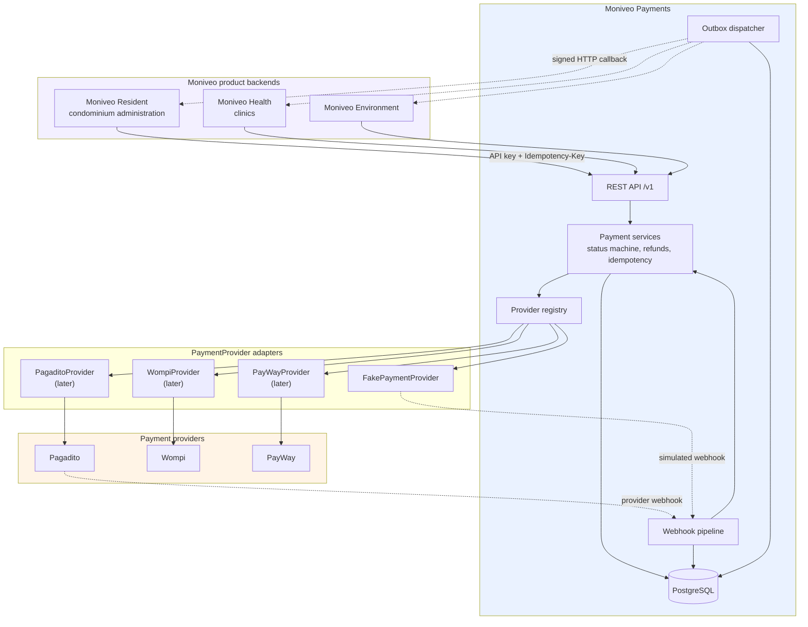
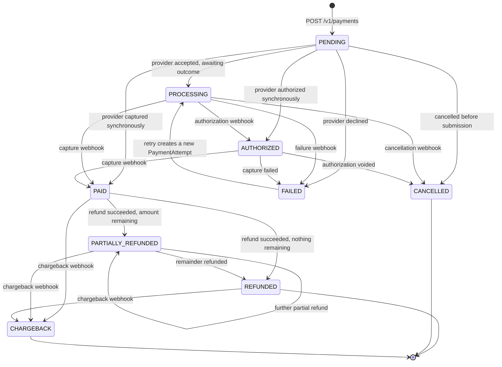
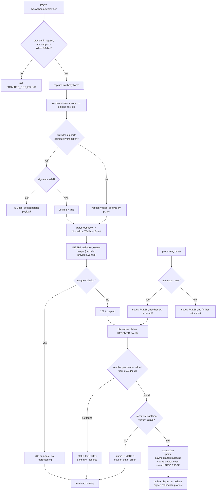

# Architecture

Moniveo Payments orchestrates charges, refunds, and provider webhooks for all Moniveo products through one shared API and PostgreSQL database.

## System context

Products never call providers directly. Payments never reads a product database.

## Payment status machine

`src/domain/payment-status.ts` defines `ALLOWED_TRANSITIONS`. `transitionPayment()` is the only code permitted to write `Payment.status`.

Illegal transitions from API calls raise `INVALID_PAYMENT_STATE`. Illegal transitions from webhooks are recorded as `IGNORED` (stale or out-of-order delivery).

## Webhook ingestion pipeline

The provider receives `202 Accepted` as soon as the event is durably stored. Processing runs asynchronously via the dispatcher.

## Internal event delivery

State changes write `outbox_events` in the same database transaction. A scheduler delivers signed JSON callbacks to product `EventSubscription` URLs with exponential backoff and at-least-once semantics.

Event types include: `payment.created`, `payment.processing`, `payment.paid`, `payment.failed`, `payment.refunded`, `payment.partially_refunded`, `refund.succeeded`, and others defined in `src/domain/events.ts`.

## Repository layout

| Path | Role |
| --- | --- |
| `src/domain/` | Pure payment rules (status machine, money, refunds) |
| `src/providers/` | Provider adapters and registry |
| `src/modules/` | Resource services and routes |
| `src/platform/` | Auth, idempotency, secrets, outbox, logging, security |
| `src/routes/dev/` | Fake provider simulation (development/test only) |
