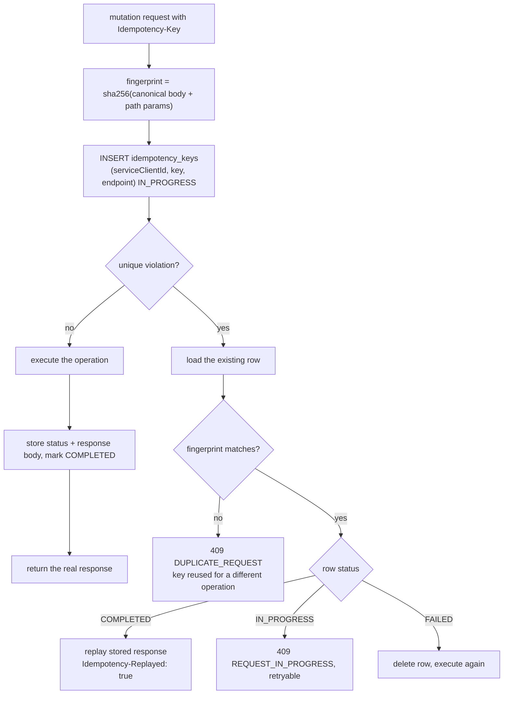

# Idempotency

All mutating `/v1` endpoints require an `Idempotency-Key` header. This prevents duplicate financial operations when clients retry after timeouts or network failures.

## Key scoping

Idempotency keys are scoped to:

- the authenticated **service client** (`serviceClientId` from the API key), and
- the **endpoint** (HTTP method + route pattern).

Two different products may use the same key string independently. The same client reusing a key on a different endpoint creates a separate row.

## Fingerprint

On first receipt, the service computes:

```
fingerprint = sha256(canonical JSON body + path parameters)
```

Canonicalization stable-sorts JSON keys so `{ "a": 1, "b": 2 }` matches `{ "b": 2, "a": 1 }`.

## First request

1. Insert `idempotency_keys` row with status `IN_PROGRESS`.
2. Execute the operation.
3. Store the response status and body; mark `COMPLETED`.
4. Return the live response.

## Replay semantics

| Situation | HTTP | Behaviour |
| --- | --- | --- |
| Same key, same fingerprint, `COMPLETED` | original status | Replay stored body; header `Idempotency-Replayed: true` |
| Same key, different fingerprint | `409` | `DUPLICATE_REQUEST` — key reused for a different operation |
| Same key, same fingerprint, `IN_PROGRESS` | `409` | `REQUEST_IN_PROGRESS` — client should retry shortly |
| Same key, same fingerprint, prior `FAILED` | retry | Row deleted; operation runs again |

A failed attempt (`500` before completion) does not block legitimate retries with the same key, because no financial side effect was committed.

## Flow diagram



## Examples

**Payment create** — Bruno `02-payments/idempotency-replay` sends the same `Idempotency-Key: bruno-pay-1` twice. The second response has `Idempotency-Replayed: true` and the same payment `id`; only one row exists in `payments`.

**Refund create** — Full and partial refunds in `03-refunds` use distinct keys (`bruno-rfnd-full-1`, `bruno-rfnd-partial-1`).

**Organization create** — `01-setup/create-organization` uses `bruno-org-1` so re-running setup is safe.

## Client guidance

- Generate a unique key per logical operation (UUID recommended).
- Reuse the key only when retrying the **exact same** request body.
- On `409 REQUEST_IN_PROGRESS`, wait briefly and retry with the same key.
- On `409 DUPLICATE_REQUEST`, generate a new key — the payload changed.
