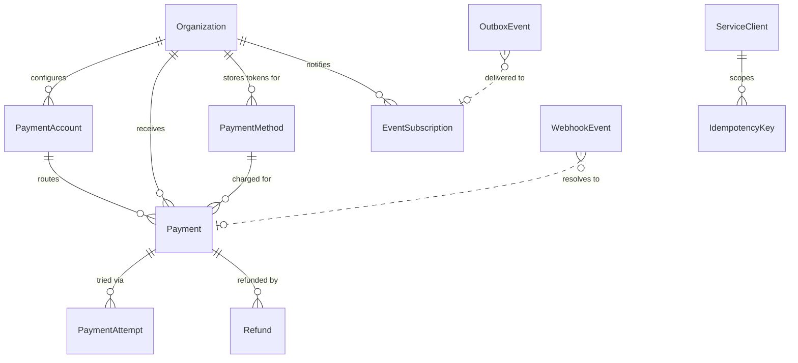

---
design:
  id: "D-002"
  title: "Prisma Data Model"
  spec_slug: "moniveo-payments-service"
  created: "2026-09-18T22:45:00Z"
  updated: "2026-09-18T22:45:00Z"
---

# Prisma Data Model

Conventions follow `moni-health` (`packages/db/prisma/schema.prisma`): PascalCase models, camelCase
Prisma fields with `@map("snake_case")`, `@@map` on every model, `@default(uuid())` identifiers, and
`createdAt` / `updatedAt` on mutable rows.

## Modelling decisions worth stating before the schema

**Money is a 32-bit integer of minor units.** `Int` in Prisma is a Postgres `integer`, capped at
2,147,483,647 minor units — roughly USD 21.4 million in a single payment. Validation rejects
anything above 2,000,000,000 minor units. `BigInt` would remove the ceiling but Prisma maps it to a
JavaScript `BigInt`, which `JSON.stringify` throws on, so every response path would need a custom
serialiser. The ceiling is several orders of magnitude above a condominium fee or a clinic invoice,
and widening to `BIGINT` later is a single non-destructive migration. Currency is a three-letter
ISO 4217 code; the minor-unit exponent lives in a code-level registry, not the database.

**`provider` is a `String`, not a Prisma enum.** A database enum means every new provider needs a
migration, which works against the requirement that a provider can be added without touching core
logic. The set of valid values comes from the provider registry and is enforced at the API boundary
by a Zod enum built from `registry.keys()`. The database keeps a `CHECK` on non-empty and an index;
it does not need to know the catalogue.

**There is no `Customer` table.** The brief lists customers as a generic concept, but every place a
customer is needed the identifier is `customerReference` — an opaque string owned by the calling
product. Creating a `Customer` row would mean synchronising identity between Payments and each
product, which is exactly the coupling the service is supposed to avoid. `customerReference` is
indexed alongside `organizationId` so the payment-methods query is efficient. If per-customer state
ever needs to live here, the table can be added without changing the external contract.

**There is no `Provider` table.** Provider metadata and capabilities are code, exposed through
`GET /v1/providers`. Storing them would create a second source of truth that can drift from the
adapter implementations.

**`sourceProduct` is denormalised onto `Payment`.** It is a write-once snapshot copied from the
organization at creation. It buys product-scoped reporting queries without a join and cannot drift
because nothing updates it.

**Refund totals are a column, not a query.** `Payment.refundedAmount` is maintained inside the same
transaction that transitions a refund to `SUCCEEDED`, and a `CHECK (refunded_amount <= amount)`
constraint makes over-refunding impossible at the database level rather than at the service level.

## Enums

```prisma
enum SourceProduct {
  RESIDENT
  HEALTH
  ENVIRONMENT
}

enum OrganizationStatus {
  ACTIVE
  SUSPENDED
  ARCHIVED
}

enum PaymentAccountStatus {
  PENDING_CONFIGURATION
  ACTIVE
  DISABLED
}

enum PaymentStatus {
  PENDING
  PROCESSING
  AUTHORIZED
  PAID
  FAILED
  CANCELLED
  REFUNDED
  PARTIALLY_REFUNDED
  CHARGEBACK
}

enum PaymentAttemptStatus {
  INITIATED
  PROCESSING
  SUCCEEDED
  FAILED
  EXPIRED
}

enum PaymentMethodType {
  CARD
  BANK_ACCOUNT
  WALLET
  OTHER
}

enum PaymentMethodStatus {
  ACTIVE
  EXPIRED
  REVOKED
}

enum RefundStatus {
  PENDING
  PROCESSING
  SUCCEEDED
  FAILED
}

enum WebhookProcessingStatus {
  RECEIVED
  PROCESSING
  PROCESSED
  IGNORED
  FAILED
}

enum OutboxStatus {
  PENDING
  DELIVERING
  DELIVERED
  FAILED
  DEAD
}

enum ServiceClientStatus {
  ACTIVE
  REVOKED
}
```

`IGNORED` on webhook processing is a first-class success state: a duplicate event, an event for an
unknown payment, or a status transition that is stale relative to what the payment already recorded
are all normal occurrences, not failures, and must not trigger retries or alerts.

## Tenancy and access

```prisma
model Organization {
  id            String             @id @default(uuid())
  sourceProduct SourceProduct      @map("source_product")
  externalId    String             @map("external_id")
  name          String
  status        OrganizationStatus @default(ACTIVE)
  metadata      Json               @default("{}")

  createdAt DateTime @default(now()) @map("created_at")
  updatedAt DateTime @updatedAt @map("updated_at")

  paymentAccounts    PaymentAccount[]
  payments           Payment[]
  paymentMethods     PaymentMethod[]
  eventSubscriptions EventSubscription[]

  @@unique([sourceProduct, externalId])
  @@index([status])
  @@map("organizations")
}
```

`(sourceProduct, externalId)` is the natural key. Resident condominium `abc` and Health clinic `abc`
are different organizations, and neither product can collide with the other's identifier space.

```prisma
model ServiceClient {
  id            String              @id @default(uuid())
  name          String
  sourceProduct SourceProduct       @map("source_product")
  keyPrefix     String              @unique @map("key_prefix")
  keyHash       String              @map("key_hash")
  scopes        String[]            @default([])
  status        ServiceClientStatus @default(ACTIVE)

  lastUsedAt DateTime? @map("last_used_at")
  revokedAt  DateTime? @map("revoked_at")
  createdAt  DateTime  @default(now()) @map("created_at")
  updatedAt  DateTime  @updatedAt @map("updated_at")

  idempotencyKeys IdempotencyKey[]

  @@index([status])
  @@map("service_clients")
}
```

An API key is presented as `mvp_<prefix>_<secret>`. The lookup is by `keyPrefix` (indexed, unique)
and the secret is compared against `keyHash` with a constant-time comparison. The plaintext key is
shown once at creation and never stored. `sourceProduct` is what satisfies "every request must
identify the calling Moniveo product". Because authentication is reduced to "resolve credential to a
`ServiceContext`", swapping API keys for signed service tokens later means adding a second
`ServiceAuthenticator` implementation and changing no controller.

```prisma
model PaymentAccount {
  id                 String               @id @default(uuid())
  organizationId     String               @map("organization_id")
  organization       Organization         @relation(fields: [organizationId], references: [id], onDelete: Cascade)

  provider           String
  providerMerchantId String               @map("provider_merchant_id")
  status             PaymentAccountStatus @default(PENDING_CONFIGURATION)
  isDefault          Boolean              @default(false) @map("is_default")

  configuration      Json                 @default("{}")
  credentialRefs     Json                 @default("{}") @map("credential_refs")

  createdAt DateTime @default(now()) @map("created_at")
  updatedAt DateTime @updatedAt @map("updated_at")

  payments Payment[]

  @@unique([organizationId, provider, providerMerchantId])
  @@index([organizationId, status])
  @@map("payment_accounts")
}
```

`configuration` holds non-sensitive settings only — return URLs, checkout mode, locale. Credentials
never appear here. `credentialRefs` holds *references*, not values:

```json
{ "apiKey": "env://PAGADITO_UID_ACME", "secret": "env://PAGADITO_WSK_ACME" }
```

The `SecretsProvider` resolves a reference to a value at call time. `env://` is the only scheme
implemented, and it is the production mechanism as well as the local one, since the confirmed
Railway deployment supplies credentials as environment variables. Because the database stores only a
pointer, there is no ciphertext at rest to manage, no key rotation problem inside this service, and
no hand-written cryptography — which is what the brief asked for.

If the estate later adopts a secret manager, the same column gains a second scheme —
`awssm://moniveo/payments/acme/wsk` or equivalent — behind a new `SecretsProvider` implementation.
No caller, no column, and no migration changes. Reference-shape validation derives its accepted
schemes from the registered implementations, so it widens on its own.

An organization may hold several accounts, so provider selection resolves in order: the account
named explicitly on the request, then the organization's default `ACTIVE` account, then an error.
`isDefault` uniqueness is a partial index added in raw SQL, since Prisma cannot express it:

```sql
CREATE UNIQUE INDEX payment_accounts_one_default_per_org
  ON payment_accounts (organization_id)
  WHERE is_default = true;
```

## Payments

```prisma
model Payment {
  id             String        @id @default(uuid())
  organizationId String        @map("organization_id")
  organization   Organization  @relation(fields: [organizationId], references: [id])

  paymentAccountId String?        @map("payment_account_id")
  paymentAccount   PaymentAccount? @relation(fields: [paymentAccountId], references: [id])

  sourceProduct     SourceProduct @map("source_product")
  externalReference String        @map("external_reference")
  customerReference String        @map("customer_reference")

  amount         Int    @db.Integer
  currency       String @db.Char(3)
  refundedAmount Int    @default(0) @map("refunded_amount")

  status   PaymentStatus @default(PENDING)
  provider String

  providerPaymentId String? @map("provider_payment_id")
  paymentMethodId   String? @map("payment_method_id")
  paymentMethod     PaymentMethod? @relation(fields: [paymentMethodId], references: [id])

  description String?
  checkoutUrl String? @map("checkout_url")
  metadata    Json    @default("{}")

  failureCode    String? @map("failure_code")
  failureMessage String? @map("failure_message")

  createdAt    DateTime  @default(now()) @map("created_at")
  updatedAt    DateTime  @updatedAt @map("updated_at")
  authorizedAt DateTime? @map("authorized_at")
  paidAt       DateTime? @map("paid_at")
  failedAt     DateTime? @map("failed_at")
  cancelledAt  DateTime? @map("cancelled_at")

  attempts PaymentAttempt[]
  refunds  Refund[]

  @@unique([organizationId, externalReference])
  @@unique([provider, providerPaymentId])
  @@index([organizationId, status, createdAt])
  @@index([organizationId, customerReference])
  @@index([sourceProduct, createdAt])
  @@map("payments")
}
```

Two independent duplicate-charge defences, guarding different failure modes:

- `@@unique([organizationId, externalReference])` is the *business* guarantee. Condominium fee
  `2026-09/unit-402` can exist exactly once. It catches a product bug that requests the same charge
  twice through two different code paths, which an idempotency key would not catch.
- The `IdempotencyKey` table is the *transport* guarantee, covering a client that retries after a
  timeout and does not know whether the first request landed.

Because `externalReference` is unique, a retry after a declined payment reuses the same `Payment`
row and adds a new `PaymentAttempt` rather than creating a second payment — which is precisely the
separation `PaymentAttempt` exists to provide.

`@@unique([provider, providerPaymentId])` prevents two payments mapping to the same provider
transaction. Postgres treats `NULL`s as distinct, so unset values do not collide while a payment is
still `PENDING`.

`refundedAmount` and `amount` are constrained in raw SQL:

```sql
ALTER TABLE payments
  ADD CONSTRAINT payments_amount_positive     CHECK (amount > 0),
  ADD CONSTRAINT payments_refund_non_negative CHECK (refunded_amount >= 0),
  ADD CONSTRAINT payments_refund_within_total CHECK (refunded_amount <= amount),
  ADD CONSTRAINT payments_currency_iso        CHECK (currency ~ '^[A-Z]{3}$');
```

Over-refunding is therefore impossible even if two refund requests race, because both would have to
pass the same check inside their own transaction and the loser aborts.

```prisma
model PaymentAttempt {
  id        String  @id @default(uuid())
  paymentId String  @map("payment_id")
  payment   Payment @relation(fields: [paymentId], references: [id], onDelete: Cascade)

  attemptNumber Int    @map("attempt_number")
  provider      String

  providerPaymentId String?              @map("provider_payment_id")
  status            PaymentAttemptStatus @default(INITIATED)

  failureCode      String? @map("failure_code")
  failureMessage   String? @map("failure_message")
  providerMetadata Json    @default("{}") @map("provider_metadata")

  createdAt   DateTime  @default(now()) @map("created_at")
  updatedAt   DateTime  @updatedAt @map("updated_at")
  completedAt DateTime? @map("completed_at")

  @@unique([paymentId, attemptNumber])
  @@unique([provider, providerPaymentId])
  @@index([paymentId, createdAt])
  @@map("payment_attempts")
}
```

`providerMetadata` is the containment boundary for provider-shaped data. Raw provider responses are
stored here for support and reconciliation, and nothing outside the adapter reads the contents.
This is what stops provider structures leaking into the domain while still preserving the
information a support engineer needs.

## Payment methods

```prisma
model PaymentMethod {
  id             String       @id @default(uuid())
  organizationId String       @map("organization_id")
  organization   Organization @relation(fields: [organizationId], references: [id], onDelete: Cascade)

  customerReference String @map("customer_reference")
  provider          String

  providerPaymentMethodId String @map("provider_payment_method_id")

  type   PaymentMethodType
  status PaymentMethodStatus @default(ACTIVE)

  brand           String?
  last4           String? @db.Char(4)
  expirationMonth Int?    @map("expiration_month")
  expirationYear  Int?    @map("expiration_year")
  holderName      String? @map("holder_name")

  isDefault Boolean @default(false) @map("is_default")
  metadata  Json    @default("{}")

  createdAt DateTime  @default(now()) @map("created_at")
  updatedAt DateTime  @updatedAt @map("updated_at")
  revokedAt DateTime? @map("revoked_at")

  payments Payment[]

  @@unique([provider, providerPaymentMethodId])
  @@index([organizationId, customerReference, status])
  @@map("payment_methods")
}
```

The columns are the constraint. There is no field capable of holding a PAN, a CVV, or track data —
`last4` is a fixed four-character column and there is no `cardNumber` anywhere in the schema. A
storage violation would require a schema migration, which is reviewable.

One default method per customer per organization, again a partial index:

```sql
CREATE UNIQUE INDEX payment_methods_one_default_per_customer
  ON payment_methods (organization_id, customer_reference)
  WHERE is_default = true AND status = 'ACTIVE';
```

## Refunds

```prisma
model Refund {
  id        String  @id @default(uuid())
  paymentId String  @map("payment_id")
  payment   Payment @relation(fields: [paymentId], references: [id])

  organizationId String @map("organization_id")

  amount   Int    @db.Integer
  currency String @db.Char(3)
  isPartial Boolean @map("is_partial")

  status   RefundStatus @default(PENDING)
  provider String

  providerRefundId String? @map("provider_refund_id")
  reason           String?
  externalReference String? @map("external_reference")
  metadata         Json     @default("{}")

  failureCode    String? @map("failure_code")
  failureMessage String? @map("failure_message")

  createdAt   DateTime  @default(now()) @map("created_at")
  updatedAt   DateTime  @updatedAt @map("updated_at")
  completedAt DateTime? @map("completed_at")

  @@unique([provider, providerRefundId])
  @@index([paymentId, createdAt])
  @@index([organizationId, status])
  @@map("refunds")
}
```

Refunds are append-only financial records. Nothing in the refund flow rewrites the original payment
amount; the only field a refund touches on `Payment` is `refundedAmount`, plus the derived status
(`PARTIALLY_REFUNDED` or `REFUNDED`). The full history of what was refunded, when, by how much, and
why is reconstructable from the `refunds` table alone.

## Webhooks

```prisma
model WebhookEvent {
  id       String @id @default(uuid())
  provider String

  providerEventId String  @map("provider_event_id")
  eventType       String? @map("event_type")

  payload    Json
  rawBody    String  @map("raw_body")
  headers    Json    @default("{}")
  signature  String?
  verified   Boolean @default(false)

  paymentId String? @map("payment_id")

  processingStatus WebhookProcessingStatus @default(RECEIVED) @map("processing_status")
  attempts         Int                     @default(0)
  error            String?

  receivedAt  DateTime  @default(now()) @map("received_at")
  processedAt DateTime? @map("processed_at")
  nextRetryAt DateTime? @map("next_retry_at")

  @@unique([provider, providerEventId])
  @@index([processingStatus, nextRetryAt])
  @@index([paymentId])
  @@map("webhook_events")
}
```

`providerEventId` is required and unique per provider, which makes duplicate detection a database
constraint rather than an application check. Providers that do not supply an event identifier get a
deterministic fallback of `sha256:<hex>` over the raw body, computed by the adapter's `parseWebhook`.
Two byte-identical deliveries then collide on the unique index and the second is acknowledged as a
duplicate without reprocessing.

`rawBody` is stored as received, before any parsing, because signature verification operates on
exact bytes and re-serialising JSON destroys the signature.

Out-of-order delivery is handled in the processor rather than the schema: a transition is applied
only if it is legal from the payment's current status according to the transition table. A `PAID`
payment receiving a late `processing` event records the event as `IGNORED` and changes nothing.

## Idempotency

```prisma
model IdempotencyKey {
  id String @id @default(uuid())

  serviceClientId String        @map("service_client_id")
  serviceClient   ServiceClient @relation(fields: [serviceClientId], references: [id], onDelete: Cascade)

  key      String
  endpoint String
  requestFingerprint String @map("request_fingerprint")

  status         String  @default("IN_PROGRESS")
  responseStatus Int?    @map("response_status")
  responseBody   Json?   @map("response_body")

  resourceType String? @map("resource_type")
  resourceId   String? @map("resource_id")

  createdAt DateTime @default(now()) @map("created_at")
  expiresAt DateTime @map("expires_at")

  @@unique([serviceClientId, key, endpoint])
  @@index([expiresAt])
  @@map("idempotency_keys")
}
```

The flow: insert the key row with `IN_PROGRESS` in its own transaction. A unique violation means the
key has been seen. If the stored `requestFingerprint` — a SHA-256 of the canonicalised body plus
path parameters — matches, replay the stored response; if it differs, return
`DUPLICATE_REQUEST` (HTTP 409), because the same key is being reused for a different operation. A
row still `IN_PROGRESS` means a concurrent request is mid-flight, answered with HTTP 409 and a
retryable code. Keys expire after 24 hours and a cleanup job deletes expired rows.

Scoping to `serviceClientId` means Resident and Health cannot collide on the same key string, and
including `endpoint` means a key reused across a payment creation and a refund is treated as two
distinct operations rather than a conflict.

## Internal events

```prisma
model EventSubscription {
  id String @id @default(uuid())

  sourceProduct  SourceProduct @map("source_product")
  organizationId String?       @map("organization_id")
  organization   Organization? @relation(fields: [organizationId], references: [id], onDelete: Cascade)

  url        String
  secretRef  String   @map("secret_ref")
  eventTypes String[] @default([]) @map("event_types")
  active     Boolean  @default(true)

  createdAt DateTime @default(now()) @map("created_at")
  updatedAt DateTime @updatedAt @map("updated_at")

  @@index([sourceProduct, active])
  @@map("event_subscriptions")
}
```

A subscription normally belongs to a product (one callback endpoint for the whole Resident backend),
so `organizationId` is nullable; a per-organization row overrides the product-wide one. An empty
`eventTypes` array means all events.

```prisma
model OutboxEvent {
  id String @id @default(uuid())

  eventType String @map("event_type")
  eventId   String @unique @map("event_id")

  organizationId String        @map("organization_id")
  sourceProduct  SourceProduct @map("source_product")
  resourceType   String        @map("resource_type")
  resourceId     String        @map("resource_id")

  payload Json

  subscriptionId String? @map("subscription_id")

  status       OutboxStatus @default(PENDING)
  attempts     Int          @default(0)
  lastError    String?      @map("last_error")
  nextAttemptAt DateTime    @default(now()) @map("next_attempt_at")

  createdAt   DateTime  @default(now()) @map("created_at")
  deliveredAt DateTime? @map("delivered_at")

  @@index([status, nextAttemptAt])
  @@index([resourceType, resourceId])
  @@map("outbox_events")
}
```

Events are written in the same transaction as the state change that produced them, so a payment can
never become `PAID` without an event existing. Delivery is a separate concern handled by the
dispatcher, with exponential backoff and a `DEAD` terminal state after the retry budget. `eventId`
is unique and travels in the `X-Moniveo-Event-Id` header so the receiving product can deduplicate —
delivery is at-least-once, and saying so explicitly is more honest than pretending otherwise.

This is one table and one `setInterval` loop. It is the smallest construct that satisfies
"retries and idempotency" without introducing a broker, and the `EventPublisher` interface means
replacing the dispatcher with EventBridge or SQS is a single implementation swap.

## Relationship overview



## Index rationale

| Index | Query it serves |
| --- | --- |
| `organizations (source_product, external_id)` unique | product resolves its own organization |
| `payments (organization_id, external_reference)` unique | duplicate-charge prevention |
| `payments (provider, provider_payment_id)` unique | webhook resolves payment from provider id |
| `payments (organization_id, status, created_at)` | `GET /v1/payments` default listing |
| `payments (organization_id, customer_reference)` | customer payment history |
| `payment_attempts (provider, provider_payment_id)` unique | webhook resolves the specific attempt |
| `payment_methods (organization_id, customer_reference, status)` | payment-methods listing endpoint |
| `webhook_events (provider, provider_event_id)` unique | duplicate webhook detection |
| `webhook_events (processing_status, next_retry_at)` | dispatcher polls unprocessed events |
| `idempotency_keys (service_client_id, key, endpoint)` unique | idempotent replay lookup |
| `outbox_events (status, next_attempt_at)` | dispatcher polls undelivered events |

## Migration notes

Prisma cannot express `CHECK` constraints or partial unique indexes, so each is added as raw SQL in
a dedicated migration created with `prisma migrate dev --create-only` and edited before applying.
An integration test asserts each constraint actually rejects a violating write, because a constraint
nobody tested is a constraint that might have been dropped in a later migration.
