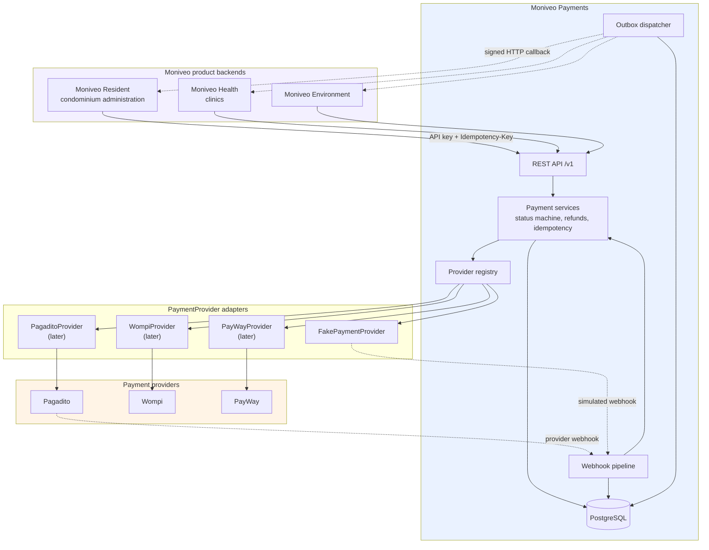
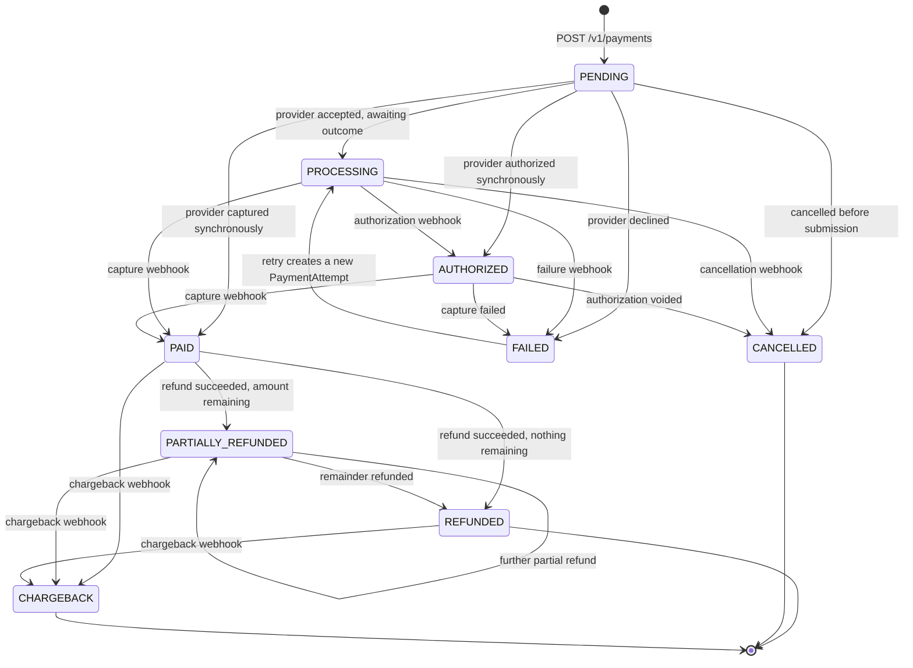
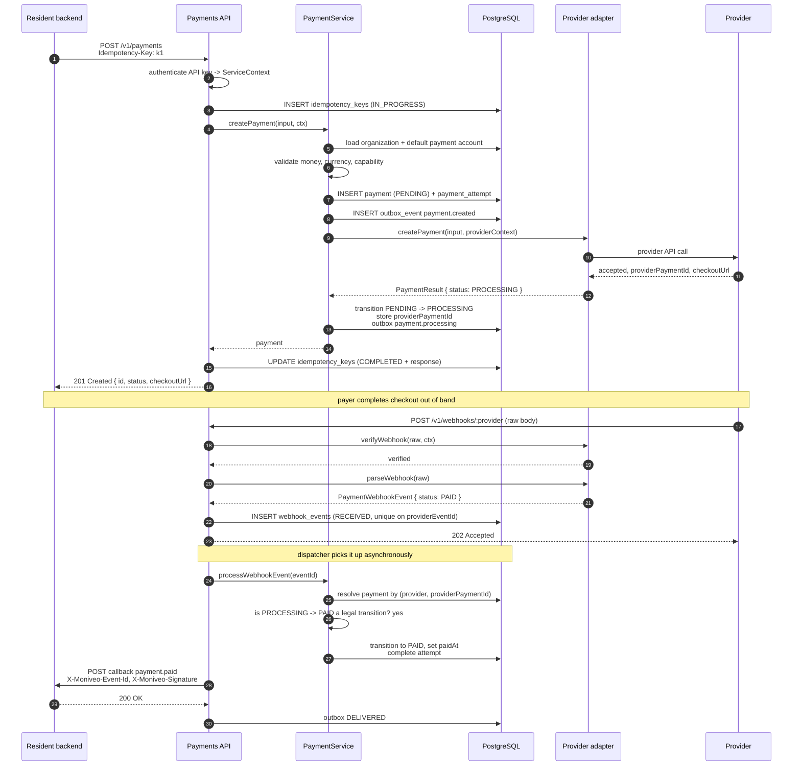
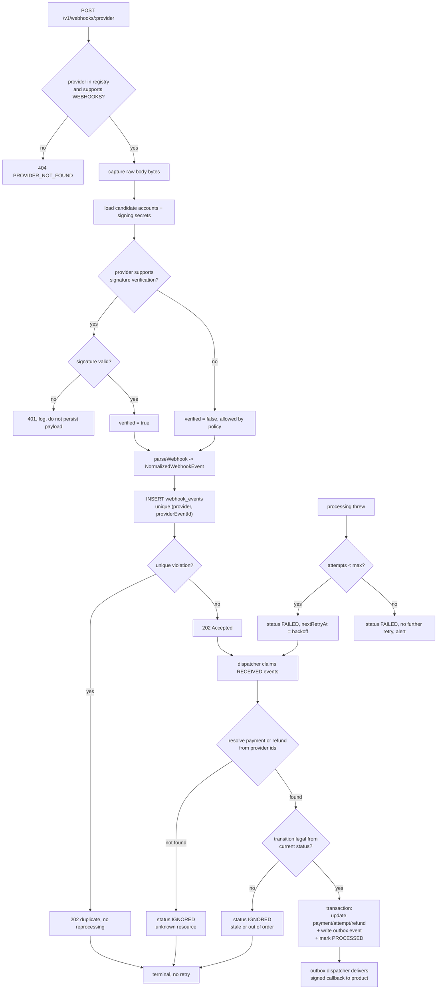
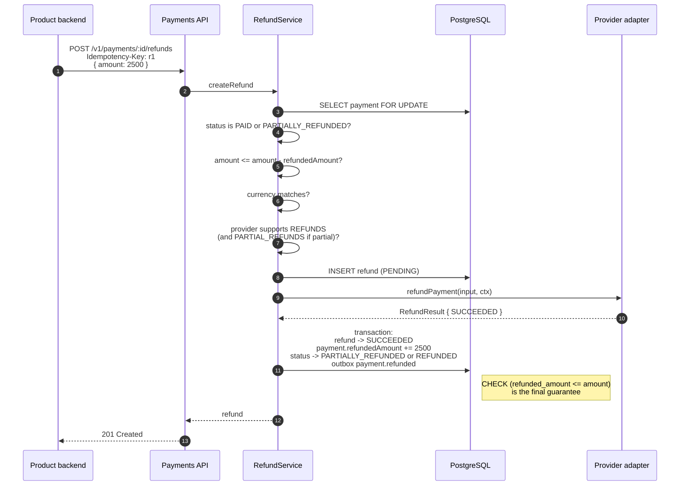
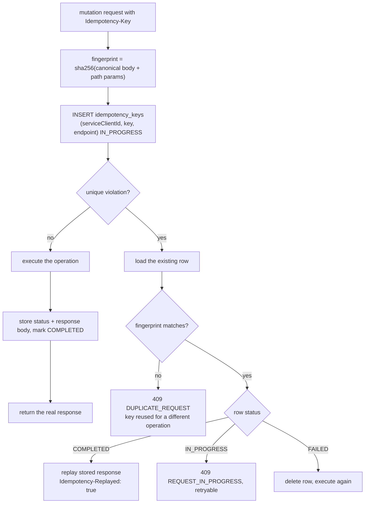
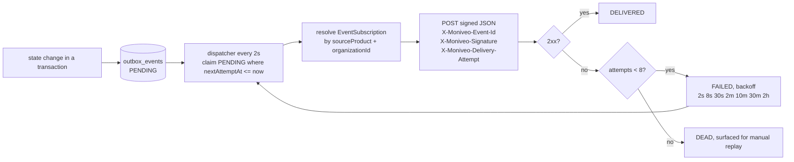
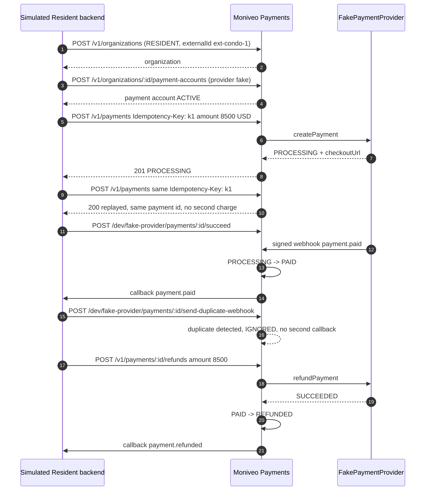

---
design:
  id: "D-004"
  title: "Payment Lifecycle"
  spec_slug: "moniveo-payments-service"
  created: "2026-09-18T22:45:00Z"
  updated: "2026-09-18T22:45:00Z"
---

# Payment Lifecycle

## System context



The only arrows from a product go to the Payments API, and the only arrows to an external provider
come from an adapter. Nothing crosses from a product to a provider, and nothing crosses from
Payments into a product database.

## Payment status machine



The table lives in `src/domain/payment-status.ts` as data, not as scattered `if` statements:

```ts
export const ALLOWED_TRANSITIONS: Record<PaymentStatus, readonly PaymentStatus[]> = {
  PENDING:            ['PROCESSING', 'AUTHORIZED', 'PAID', 'FAILED', 'CANCELLED'],
  PROCESSING:         ['AUTHORIZED', 'PAID', 'FAILED', 'CANCELLED'],
  AUTHORIZED:         ['PAID', 'FAILED', 'CANCELLED'],
  PAID:               ['PARTIALLY_REFUNDED', 'REFUNDED', 'CHARGEBACK'],
  PARTIALLY_REFUNDED: ['PARTIALLY_REFUNDED', 'REFUNDED', 'CHARGEBACK'],
  REFUNDED:           ['CHARGEBACK'],
  FAILED:             ['PROCESSING'],
  CANCELLED:          [],
  CHARGEBACK:         [],
} as const;
```

Notes on the less obvious edges:

- `FAILED -> PROCESSING` is the retry path. The `Payment` row is reused because
  `externalReference` is unique per organization, and a new `PaymentAttempt` records the retry. The
  earlier attempt's failure detail survives on its own row, so no history is overwritten.
- Anything reachable from `PAID` is also reachable from `PARTIALLY_REFUNDED`, because a partially
  refunded payment is still a captured payment.
- `CHARGEBACK` is terminal here. Representment and dispute handling are deliberately out of scope
  for milestone 1; the status exists so the event can be recorded and the product notified.
- `CANCELLED` is terminal. A cancelled charge that later needs collecting is a new business fact and
  gets a new `externalReference`.

`transitionPayment()` is the only function permitted to write `Payment.status`. It validates the
edge, sets the matching timestamp (`authorizedAt`, `paidAt`, `failedAt`, `cancelledAt`), writes the
outbox event, and does all of it in one transaction. An illegal transition from an API call raises
`INVALID_PAYMENT_STATE`; an illegal transition arriving from a webhook is not an error at all — it
is a stale or out-of-order delivery and the event is recorded as `IGNORED`.

## Happy path: create through callback



The acknowledgement at step 21 happens before processing. The provider gets a fast `202` as soon as
the event is durably stored, and correctness does not depend on how long processing takes or whether
it succeeds on the first try.

## Webhook ingestion pipeline



Three distinct non-error outcomes end in `IGNORED`: duplicate, unknown resource, and stale
transition. Keeping them separate from `FAILED` is what prevents normal provider behaviour from
generating a retry storm and an on-call page.

## Refund flow



`SELECT ... FOR UPDATE` serialises concurrent refunds against the same payment. Even if that lock
were removed, the `CHECK` constraint would still make over-refunding impossible — the validation is
belt and braces on purpose, because this is the one arithmetic error in a payments system that
directly loses money.

Some providers report refunds asynchronously. In that case the adapter returns `PROCESSING`,
`refundedAmount` is not incremented, and the increment happens when the refund webhook arrives. The
same transactional block handles both entry points.

## Idempotent create



Storing a failed attempt as `FAILED` and allowing a retry with the same key is deliberate: a request
that failed with a 500 never produced a financial operation, so refusing to let the client retry
with the same key would push it toward generating a new key, which is the behaviour most likely to
cause an actual double charge.

## Internal event delivery



Event names, matching the brief: `payment.created`, `payment.processing`, `payment.authorized`,
`payment.paid`, `payment.failed`, `payment.cancelled`, `payment.refunded`,
`payment.partially_refunded`, `payment.chargeback`, `refund.succeeded`, `refund.failed`.

Every delivery carries a stable `eventId` so the receiving product can deduplicate. Delivery is
at-least-once and the documentation states that plainly rather than implying exactly-once semantics
that the transport cannot provide.

## Milestone 1 demonstration path



This sequence is implemented verbatim as `tests/e2e/payment-lifecycle.e2e.test.ts` and mirrored in
the Bruno collection, so the milestone is demonstrable both automatically and by hand.
